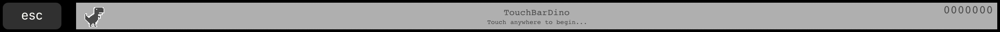
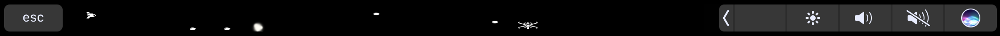
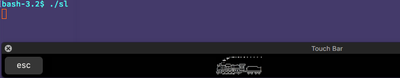

# awesome-touchbar 

:point_right: :star2: delightful macOS resources for your touchbar

follow me on [twitter](https://twitter.com/TheMightyCraken) or check out my [medium](https://medium.com/@ZakRidouh)!

thanks!

---

## Table of Contents:

* [Games](#games)
* [Demos](#demos)
* [Productivity](#prod)
* [Fun](#fun)

---

### Games:

* [TouchBarDino](https://github.com/yuhuili/TouchBarDino) - Chrome dinosaur game on Touch Bar

* [Touch Bar Space Fight](https://github.com/insidegui/TouchBarSpaceFight) - A simple, fun game for the MacBook Pro's Touch Bar

### Demos:

* [TouchBar Demo App](https://github.com/bikkelbroeders/TouchBarDemoApp) - Demo how the touchbar works on your iPad!

### Productivity:
* [Muse spotify controller](https://github.com/xzzz9097/Muse) - An open-source Spotify controller with TouchBar support

### Fun:
* [touchbar_nyancat](https://github.com/avatsaev/touchbar_nyancat) - watch nyancat fly across your touchbar!
* [SL on touch bar](https://github.com/NeoCat/sl_on_touchbar) - Run the SL on the touch bar of your MacBook Pro!

* [TouchBar Santa](https://github.com/airbyte/touchbar_santa) - Santa Claus is coming to your Touch Bar
* [Touch Bar Bar](https://github.com/guidouil/TouchBarBar) - A bar app for the new Macbook Pro's Touch Bar

---

Want to add anything? Open an [issue](issues/new)! (or even better, a [PR](pulls)! :smile:)
